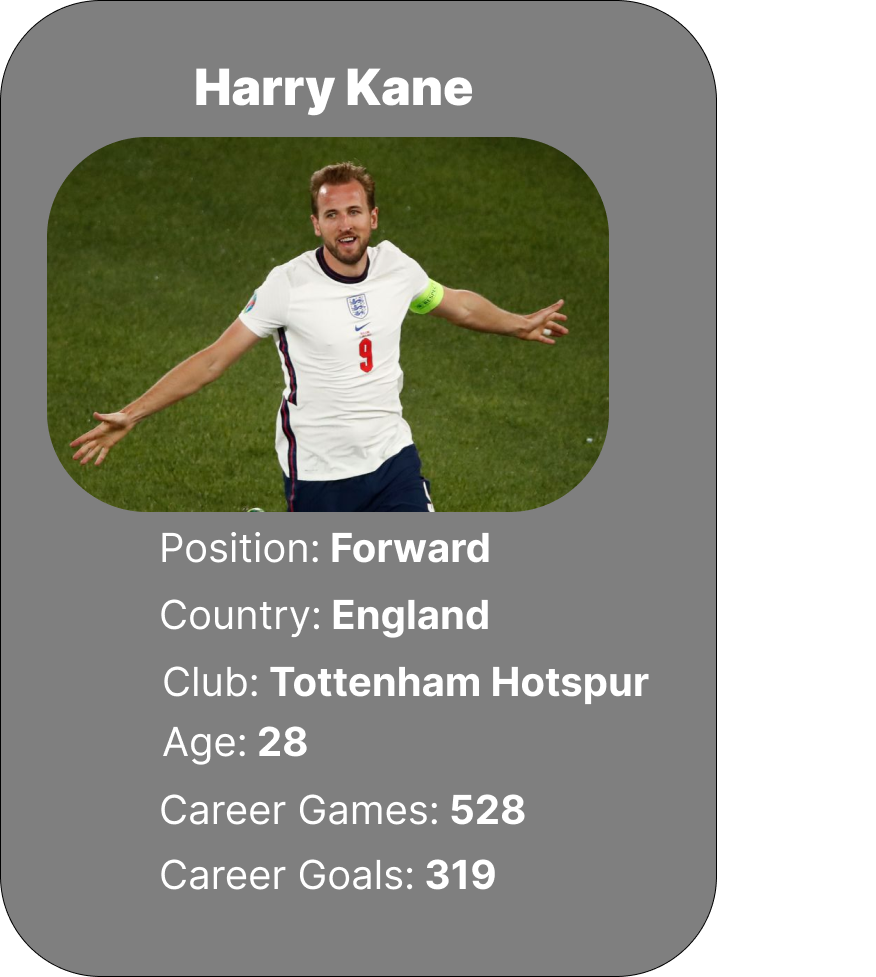
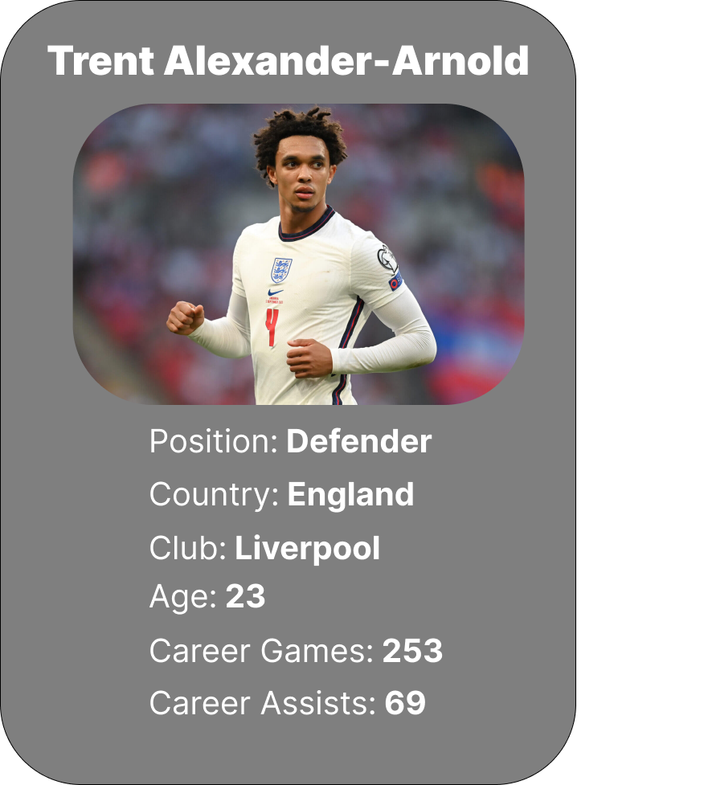

<body>
	

		

			<h3>Analyzing England Soccer Superstars</h3>
		

	

	

		

			
Although the English men's soccer team is one of the oldest national teams in the world, they’ve only won a single major tournament: the 1966 World Cup.

			
Can they win this year's World Cup?

			
We'll analyze their squad through a few different perspectives, focusing on 3 key players:

		

	

	

		

			

				
			

			

				
			

			

				
			

		

	

	<!-- >
	Example of using an event handler and linking to a external js func.
	

		
Test Text Here

		<button onclick="changeColor()">Test Button Here</button>
	

	-->
	

		

			<h3>England's Tactics: Our Recommendation</h3>
		

	

	

		

			
Let's compare how they selected and arranged their team formation in the 2020 Euro Cup Final vs. Italy to the lineup that our group thinks would give them the best chance of winning!

		

	

	

		

			

				<h5>3-4-2-1</h5>
				<!--
				
This is how England at Euro 2020 Final. Starting with 3 defenders at the back can underpin an aggressively offensive strategy, but England's personnel included an equal number of defenders and attacking players. This resulted in a rather rigid gameplan that produced few promising attack chances -- save for an almost immediate goal in the second minute, courtesy of Luke Shaw.

				-->	
				<input type="image" src="extra/default-tactics-board.png" style="opacity: 0.6;" onclick="default_lineup()"  onmouseout="this.style.opacity=0.6;" onmouseover="this.style.opacity=1;"/>
				
England's formation for the Euro 2020 Finals match...where they lost to Italy.

			

			

				<h5>4-2-3-1</h5>
				
How England <i>should</i> play.

			

		
	
	

	

		

		

	

</body>